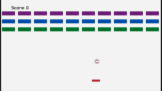

# C Breakout

'C Breakout', written in C.

<p align ="center" width="100%">
    
</p>

<p align ="center" width="100%">
    <video width="320" height="240" controls>
        <source src="./assets/demo.mp4" type="video/mp4">
    </video>
</p>

## Dependencies

- [Raylib](https://www.raylib.com/)


## Build

Build the executable for your system via the following command:

```bash
gcc -O0 -pedantic-errors -Wall -Wextra -Wconversion -Wsign-conversion -ggdb -lraylib -lGL -lm -lpthread -ldl -lrt -lX11 ./src/util.c ./src/main.c
```

## Run the Program

Set the environment variables required to run raylib:

```bash
source env_var.bash
```

and then run the built executable:

```bash
./a.out # a.out gets built via the buid step
```
